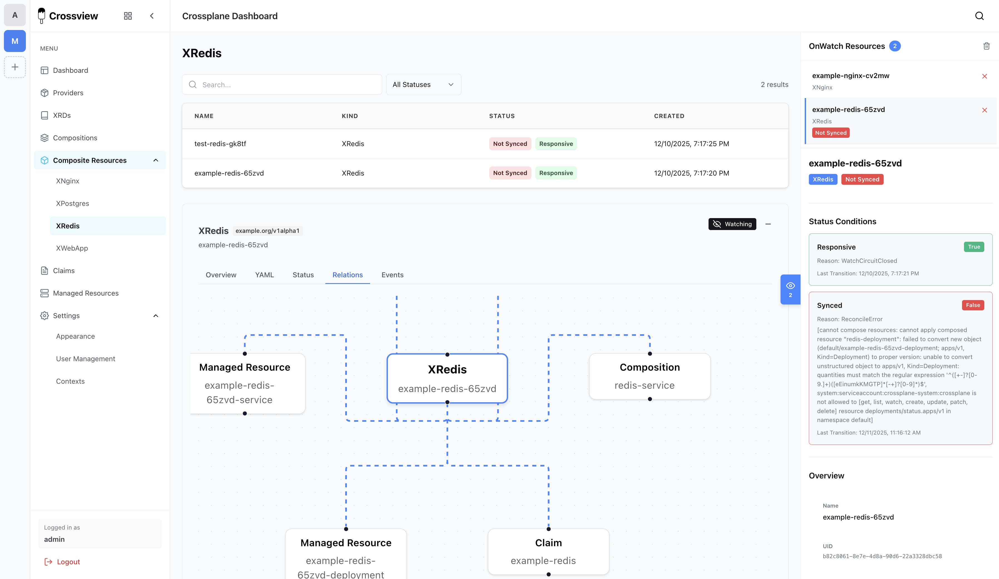

<div align="center">
  
  
# Crossview - Crossplane Dashboard
  
  A modern React-based dashboard for managing and monitoring Crossplane resources in Kubernetes. Visualize, search, and manage your infrastructure-as-code with ease.

[](https://github.com/corpobit/crossview)
[](https://opensource.org/licenses/Apache-2.0)
  [](https://artifacthub.io/packages/search?repo=crossview)
</div>



## Getting Started

### Prerequisites

- Node.js 20+
- PostgreSQL database (port 8920 by default, or set via `DB_PORT` env var)
- Kubernetes config file at `~/.kube/config` (or set `KUBECONFIG` env var)

### Install Dependencies

```bash
npm install
```

### Configuration

Copy the example config file and update with your settings:

```bash
cp config/config.yaml.example config/config.yaml
```

Edit `config/config.yaml` with your database credentials:
- Database port: `8920` (or your port)
- Database password: `password` (or your password)

Alternatively, use environment variables (they take precedence):
```bash
export DB_HOST=localhost
export DB_PORT=8920
export DB_NAME=crossview
export DB_USER=postgres
export DB_PASSWORD=password
```

### Development

**Option 1: Run both frontend and backend together (recommended)**

```bash
npm run dev:all
```

This starts:
- Frontend dev server at `http://localhost:5173` (with hot reload)
- Backend API server at `http://localhost:3001`

**Option 2: Run separately**

Terminal 1 - Frontend:
```bash
npm run dev
```

Terminal 2 - Backend:
```bash
npm run dev:server
```

The app will be available at `http://localhost:5173` (frontend proxies `/api` requests to backend at `http://localhost:3001`)

### Build

Build for production:

```bash
npm run build
```

This creates a `dist/` folder with the compiled frontend.

### Production Mode

To run in production mode (serves both frontend and backend from one server):

```bash
NODE_ENV=production npm run build
NODE_ENV=production npm start
```

The app will be available at `http://localhost:3001` (both frontend and API)

## Backend API

The backend API runs on port 3001 and provides the following endpoints:

- `GET /api/health` - Health check and connection status
- `GET /api/namespaces` - List all namespaces
- `GET /api/resources?apiVersion=&kind=&namespace=` - List resources
- `GET /api/resource?apiVersion=&kind=&name=&namespace=` - Get single resource
- `GET /api/crossplane/resources?namespace=` - List Crossplane resources
- `POST /api/auth/login` - User login
- `POST /api/auth/logout` - User logout
- `GET /api/auth/check` - Check authentication status

The backend uses `KubernetesRepository` from `src/data/repositories/KubernetesRepository.js` to access Kubernetes clusters:

**When running in a Kubernetes pod:**
- Automatically uses service account token (no config file needed)
- Accesses the same cluster the pod is running in
- Uses `/var/run/secrets/kubernetes.io/serviceaccount/`

**When running locally or with mounted config:**
- `~/.kube/config` (default)
- `KUBECONFIG` environment variable
- `KUBE_CONFIG_PATH` environment variable

See [Kubernetes Deployment Guide](docs/KUBERNETES_DEPLOYMENT.md) for deployment examples.

## Helm Chart

Crossview can be deployed using Helm, which simplifies Kubernetes deployment and management.

### Add the Helm Repository

```bash
helm repo add crossview https://corpobit.github.io/crossview
helm repo update
```

### Install with Helm

```bash
helm install crossview crossview/crossview \
  --namespace crossview \
  --create-namespace \
  --set secrets.dbPassword=your-db-password \
  --set secrets.sessionSecret=$(openssl rand -base64 32)
```

For more details, see:
- [Helm Deployment Guide](docs/HELM_DEPLOYMENT.md) - Complete Helm deployment guide
- [Helm Chart Reference](helm/crossview/README.md) - All available chart options

## Docker

### Build the Docker Image

```bash
docker build -t crossview:latest .
```

### Run with Environment Variables (Recommended)

Environment variables take precedence over config files:

```bash
docker run -p 3001:3001 \
  -e DB_HOST=host.docker.internal \
  -e DB_PORT=8920 \
  -e DB_NAME=crossview \
  -e DB_USER=postgres \
  -e DB_PASSWORD=password \
  -e KUBECONFIG=/app/.kube/config \
  -e SESSION_SECRET=your-secret-key-here \
  -v ~/.kube/config:/app/.kube/config:ro \
  crossview:latest
```

### Run with Config File

Mount your config file as a volume:

```bash
docker run -p 3001:3001 \
  -v $(pwd)/config/config.yaml:/app/config/config.yaml:ro \
  -e KUBECONFIG=/app/.kube/config \
  -v ~/.kube/config:/app/.kube/config:ro \
  crossview:latest
```

### Run with Docker Compose

Create a `docker-compose.yml`:

```yaml
version: '3.8'

services:
  crossview:
    build: .
    ports:
      - "3001:3001"
    environment:
      - DB_HOST=postgres
      - DB_PORT=5432
      - DB_NAME=crossview
      - DB_USER=postgres
      - DB_PASSWORD=password
      - KUBECONFIG=/app/.kube/config
      - SESSION_SECRET=your-secret-key-here
    volumes:
      - ./config/config.yaml:/app/config/config.yaml:ro
      - ~/.kube/config:/app/.kube/config:ro
    depends_on:
      - postgres

  postgres:
    image: postgres:15-alpine
    environment:
      - POSTGRES_DB=crossview
      - POSTGRES_USER=postgres
      - POSTGRES_PASSWORD=password
    ports:
      - "8920:5432"
    volumes:
      - postgres_data:/var/lib/postgresql/data

volumes:
  postgres_data:
```

Then run:
```bash
docker-compose up
```

### Configuration Priority

The application loads configuration in this order (highest to lowest priority):
1. **Environment variables** (e.g., `DB_HOST`, `DB_PORT`, `DB_PASSWORD`)
2. **Config file** (`config/config.yaml` - mounted or included in image)
3. **Default values** (fallback)

### Required Environment Variables for Docker

- `DB_HOST` - Database host (use `host.docker.internal` for local DB, or service name in Docker Compose)
- `DB_PORT` - Database port (default: 5432)
- `DB_NAME` - Database name
- `DB_USER` - Database user
- `DB_PASSWORD` - Database password
- `KUBECONFIG` or `KUBE_CONFIG_PATH` - Path to Kubernetes config file inside container
- `SESSION_SECRET` - Secret for session encryption (optional, has default)

## Documentation

### Getting Started
- [Getting Started Guide](docs/GETTING_STARTED.md) - Quick start and first steps
- [Features & Capabilities](docs/FEATURES.md) - What Crossview can do

### Deployment
- [Helm Deployment](docs/HELM_DEPLOYMENT.md) - Deploy using Helm (recommended)
- [Kubernetes Deployment](docs/KUBERNETES_DEPLOYMENT.md) - Deploy using Kubernetes manifests
- [Helm Chart Reference](helm/crossview/README.md) - Complete Helm chart options

### Configuration
- [Configuration Guide](docs/CONFIGURATION.md) - Configure Crossview for your environment
- [SSO Setup](docs/SSO_SETUP.md) - Configure Single Sign-On (OIDC/SAML)
- [SSO Protocols](docs/SSO_PROTOCOLS.md) - Understanding OIDC and SAML

### Support
- [Troubleshooting](docs/TROUBLESHOOTING.md) - Common issues and solutions
- [Kubernetes Manifests](k8s/README.md) - Reference for Kubernetes manifests
- [Keycloak Setup](keycloak/README.md) - Keycloak integration guide

## Tech Stack

- **React** - UI library
- **Vite** - Build tool and dev server
- **Chakra UI** - Component library
- **React Router** - Routing
- **@kubernetes/client-node** - Kubernetes client (for backend)

## Contributing

Contributions are welcome! Here are some guidelines to help you get started:

### Getting Started
1. Fork the repository
2. Create a feature branch (`git checkout -b feature/amazing-feature`)
3. Make your changes
4. Commit your changes (`git commit -m 'Add some amazing feature'`)
5. Push to the branch (`git push origin feature/amazing-feature`)
6. Open a Pull Request

### Code Style
- Follow the existing code style and architecture patterns
- Keep functions focused and maintainable
- Add comments for complex logic
- Ensure your code passes linting (`npm run lint`)

### Pull Requests
- Keep PRs focused on a single feature or fix
- Include a clear description of what the PR does
- Test your changes before submitting
- Make sure all existing tests pass

### Reporting Issues
- Use the GitHub issue tracker
- Provide clear steps to reproduce bugs
- Include relevant environment details (OS, Node version, etc.)

### Questions?
Feel free to open an issue for questions or discussions about the project.

## License

This project is open source and available under the [Apache License 2.0](LICENSE).
